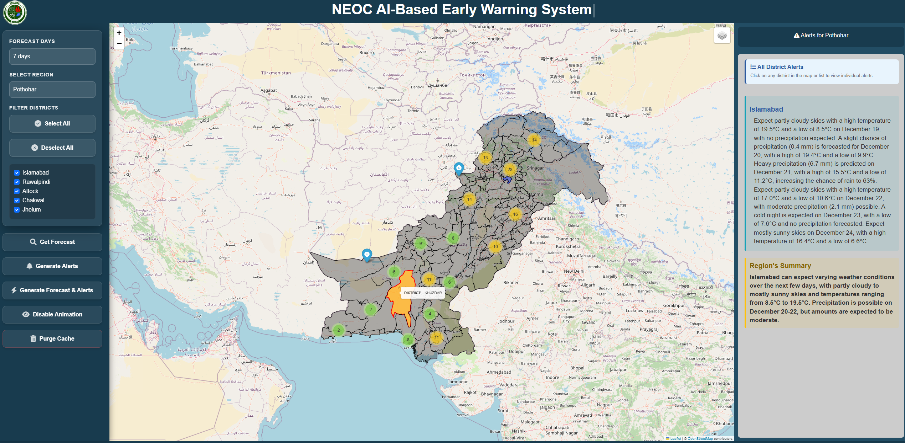

# NEOC AI-Based Early Warning System

A sophisticated, high-performance geospatial analytics dashboard for automated weather forecasting and early warning alerts across Pakistan.



## Core Capabilities

*   **Geospatial Intelligence**: Interactive map with real-time district-level weather visualization and dynamic heat-map blinking effects.
*   **Local LLM Inference**: AI-powered alert generation using localized Large Language Models (Ollama) for high data privacy and reduced latency.
*   **Multiple Weather Models**: Integration with global weather data providers via Open-Meteo for reliable forecasting.
*   **Intelligent Analytics**: Automated nowcasting and trend analysis for temperature, precipitation, and extreme weather events.
*   **High-Performance Caching**: **SQLite-based** persistence layer for efficient O(1) data retrieval, replacing legacy file-based I/O.
*   **Professional UI/UX**: State-of-the-art Glassmorphic design with responsive animations and real-time typing effects.

## Technology Stack

*   **Backend**: Python / Flask (Layered Service-Oriented Architecture)
*   **Database**: SQLite (Asset Caching & Alert Persistence)
*   **Geospacial**: Folium / Leaflet / GeoPandas
*   **Inference**: Local LLM Deployment (Ollama / LangChain)
*   **Frontend**: Vanilla JS (Typed.js, Bootstrap 5, FontAwesome)

## System Architecture

The system follows a modular micro-service pattern within a monolithic Flask application, ensuring separation of concerns and scalability.

```mermaid
graph TD
    Client[Web Client] <-->|HTTP/AJAX| App[Flask Verification]
    
    subgraph "Core Application"
        App --> WeatherSvc[Weather Service]
        App --> AlertSvc[Alert Service]
        App --> MapSvc[Map Service]
    end
    
    subgraph "Data Persistence"
        WeatherSvc <-->|Read/Write| DB[(SQLite Database)]
        AlertSvc <-->|Read/Write| DB
        MapSvc <-->|Read Only| DB
    end
    
    subgraph "External Services"
        WeatherSvc <-->|API| OpenMeteo[Weather API]
        AlertSvc <-->|Inference| Ollama[Local LLM (Llama 3)]
        MapSvc -->|Tiles| Mapbox[Mapbox API]
    end
```

## Workflows

### 1. Alert Generation Workflow

1.  **User Request**: User selects province and forecast duration.
2.  **Data Fetch**: `WeatherService` fetches raw data from Open-Meteo.
3.  **Caching**: Data is structured and cached in `weather.db` (SQLite).
4.  **Inference**: `AlertService` retrieves cached data and prompts the Local LLM.
5.  **Persistence**: Generated alerts are saved to `weather.db`.
6.  **Response**: Alerts are returned to the user and displayed on the map.

### 2. Map Visualization Logic

*   **Pre-Loading**: `MapService` queries `weather.db` for all available district data in minimal time.
*   **Rendering**: Generates Folium map with custom markers.
*   **Alert Indication**: If an alert exists in `weather.db` for a district, the marker popup includes a **Critical Alert** action button.

## Installation

### Prerequisites

*   Python 3.10+
*   [Ollama](https://ollama.ai/) (Running locally)
*   Mapbox API Token

### Setup

1.  **Clone & Navigate**:
    ```bash
    git clone <repository-url>
    cd earlywarnings
    ```

2.  **Environment Configuration**:
    ```bash
    cp .env.example .env
    # Edit .env and configure MAPBOX_TOKEN
    ```

3.  **Dependency Installation**:
    ```bash
    pip install -r requirements.txt
    ```

4.  **Database Initialization**:
    The system automatically creates `weather.db` on the first run.

5.  **Launch Application**:
    ```bash
    python app.py
    ```

## Configuration Matrix

| Variable | Description | Default |
|----------|-------------|---------|
| `MAPBOX_TOKEN` | Required for premium Mapbox tiles | `N/A` |
| `OLLAMA_BASE_URL` | Endpoint for local model inference | `http://localhost:11434` |
| `OLLAMA_MODEL` | ID of the local model to be used | `llama3.1` |
| `SECRET_KEY` | Session encryption key | `dev_secret` |
| `CACHE_TIME` | Data persistence duration (seconds) | `43200` |

## Quality Assurance

The system maintains a rigorous testing protocol:
```bash
# Execute local test suite
pytest tests/ -v
```

## License

Confidential - NEOC Internal Use Only.
