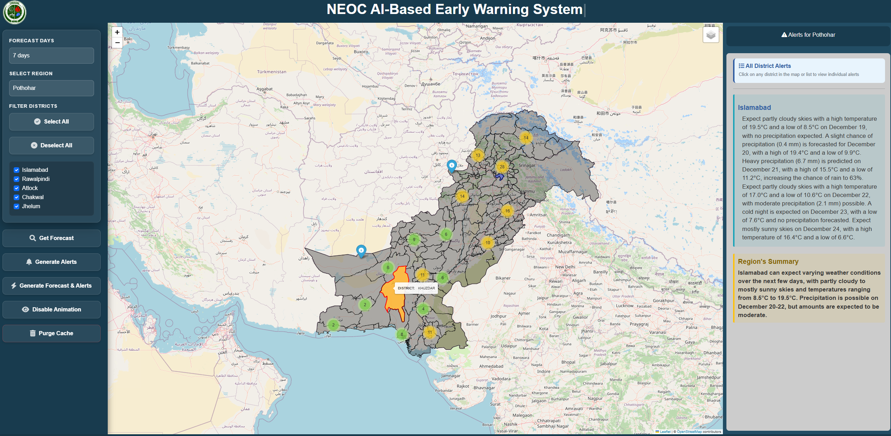
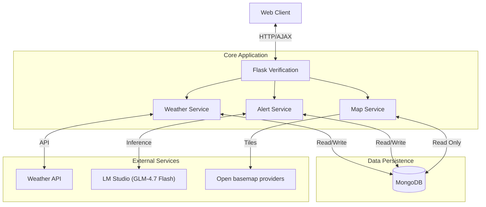

# NEOC AI-Based Early Warning System

A sophisticated, high-performance geospatial analytics dashboard for automated weather forecasting and early warning alerts across Pakistan.



## Core Capabilities

* **Geospatial Intelligence**: Interactive map with real-time district-level weather visualization and dynamic heat-map blinking effects.
* **15-Day Forecast Horizon**: Validated district forecasts from 1 through 15 days with freshness and provenance metadata.
* **Local LLM Inference**: AI-powered alert generation through LM Studio for high data privacy and reduced latency.
* **Multiple Weather Models**: Integration with global weather data providers via Open-Meteo for reliable forecasting.
* **Ensemble Corroboration**: ECMWF and NCEP GEFS ensemble spread computed per field to quantify forecast uncertainty.
* **Bilingual Alerts**: Automatic generation of weather alerts in both **English and Urdu**, featuring native Right-to-Left (RTL) text rendering for Urdu.
* **Intelligent Analytics**: Automated nowcasting and trend analysis for temperature, precipitation, and extreme weather events.
* **Reliable Forecast Persistence**: MongoDB stores immutable forecast runs, freshness metadata, cache records, and alerts.
* **Professional UI/UX**: State-of-the-art Glassmorphic design with responsive animations and real-time typing effects.

## Technology Stack

* **Backend**: Python / Flask (Layered Service-Oriented Architecture)
* **Database**: MongoDB (Forecast Runs, Cache, and Alert Persistence)
* **Geospacial**: Folium / Leaflet / GeoPandas
* **Inference**: LM Studio OpenAI-compatible server with LangChain
* **Frontend**: Vanilla JS (Typed.js, Bootstrap 5, FontAwesome)

## System Architecture

The system follows a modular micro-service pattern within a monolithic Flask application, ensuring separation of concerns and scalability.


```mermaid
graph TD
    Client[Web Client] <-->|HTTP/AJAX| App[Flask Verification]
    
    subgraph "Core Application"
        App --> WeatherSvc[Weather Service]
        App --> AlertSvc[Alert Service]
        App --> MapSvc[Map Service]
    end
    
    subgraph "Data Persistence"
        WeatherSvc <-->|Read/Write| DB[("MongoDB")]
        AlertSvc <-->|Read/Write| DB
        MapSvc <-->|Read Only| DB
    end
    
    subgraph "External Services"
        WeatherSvc <-->|API| OpenMeteo["Weather API"]
        AlertSvc <-->|Inference| LMStudio["LM Studio (GLM-4.7 Flash)"]
        MapSvc -->|Tiles| OpenMaps["Open basemap providers"]
    end
```

## Workflows

### 1. Alert Generation Workflow

1. **User Request**: User selects province and forecast duration.
2. **Data Fetch**: `WeatherService` fetches raw data from Open-Meteo.
3. **Ingestion**: Forecast snapshots are validated and stored as immutable MongoDB runs.
4. **Inference**: `AlertService` retrieves cached data and prompts the Local LLM.
5. **Persistence**: Generated alerts are saved to MongoDB.
6. **Response**: Alerts are returned to the user and displayed on the map.

### 2. Map Visualization Logic

* **Pre-Loading**: `MapService` queries MongoDB for available district data.
* **Rendering**: Generates Folium map with custom markers.
* **Alert Indication**: If an alert exists in MongoDB for a district, the marker popup includes a **Critical Alert** action button.

## Installation

### Prerequisites

* Python 3.10+
* LM Studio with its local server enabled and `zai-org/glm-4.7-flash` loaded

### Setup

1. **Clone & Navigate**:

    ```bash
    git clone <repository-url>
    cd earlywarnings
    ```

2. **Environment Configuration**:

    ```bash
    cp .env.example .env
    # Edit .env and configure the application settings
    ```

3. **Dependency Installation**:

    ```bash
    uv sync
    ```

4. **Database Initialization**:
    MongoDB must be running before application startup. Required collections and indexes are created automatically.

5. **Launch Application**:

    ```bash
    start.bat
    ```

    The Windows launcher installs missing dependencies with `uv`, then starts the
    Waitress WSGI server on `0.0.0.0:5001`. Set `HOST` or `PORT` before launching
    to override those defaults.

## Configuration Matrix

| Variable | Description | Default |
|----------|-------------|---------|
| `LM_STUDIO_BASE_URL` | OpenAI-compatible local endpoint | `http://127.0.0.1:1234/v1` |
| `LM_STUDIO_MODEL` | Local model identifier | `zai-org/glm-4.7-flash` |
| `LM_STUDIO_API_KEY` | Placeholder key required by the client | `lm-studio` |
| `SECRET_KEY` | Session encryption key | `dev_secret` |
| `CACHE_TIME` | Data persistence duration (seconds) | `43200` |
| `FORECAST_FRESH_SECONDS` | Time before a stored run requires refresh | `10800` |
| `FORECAST_STALE_SECONDS` | Additional safe fallback window after freshness | `21600` |
| `MONGODB_URI` | MongoDB connection URI | `mongodb://127.0.0.1:27017` |
| `MONGODB_DATABASE` | MongoDB database name | `early_warnings` |
| `API_TIMEOUT` | Timeout for external API calls (seconds) | `120` |

## Quality Assurance

The system maintains a rigorous testing protocol:

```bash
# Execute local test suite
uv run pytest tests/ -v
```

## License

Confidential - NEOC Internal Use Only.
