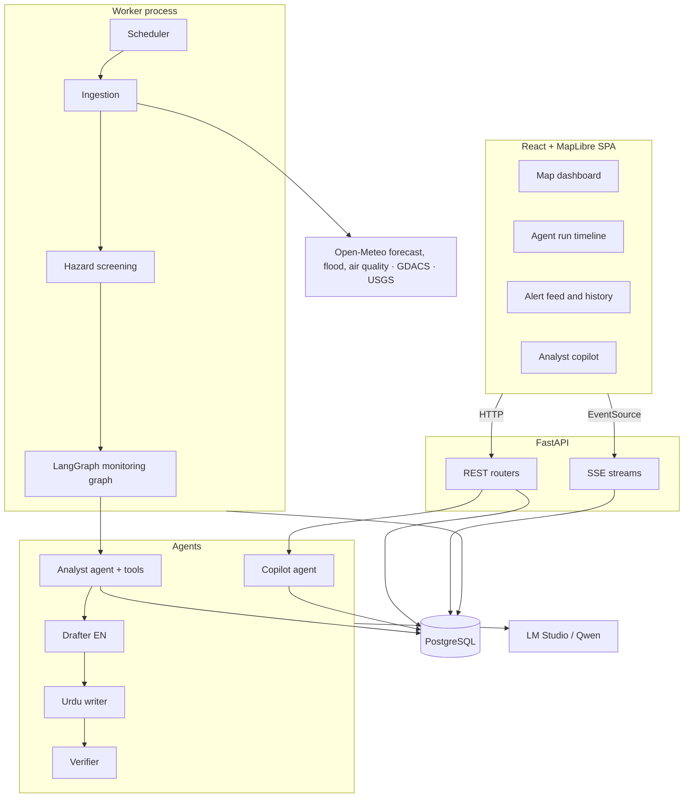
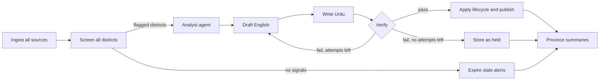

# Agentic Early Warning System — Design and Implementation Plan

Status: draft for review · Date: 2026-10-08 · Owner: imtiazNDMA

This document is the plan for turning the current Flask dashboard into an autonomous, agent-driven early warning system for Pakistan, with a FastAPI backend, a React + MapLibre frontend, and local LLM inference through LM Studio (Qwen).

---

## 1. Goal and success criteria

**Goal.** A system that watches multiple hazard data sources for every district in Pakistan on a schedule, decides by itself where something needs attention, investigates those districts with tool-calling agents, and publishes grounded bilingual (English/Urdu) alerts — with every step of its reasoning visible in the UI.

**It is a portfolio piece.** A reviewer should be able to understand in two minutes what the agents do, see evidence that the output is trustworthy, and read code that looks production-minded.

**Success criteria**

| # | Criterion | How it is checked |
|---|-----------|-------------------|
| 1 | A monitoring cycle runs unattended end to end and publishes or updates alerts | Scheduled run completes with status `succeeded`; alerts appear without a click |
| 2 | Every published alert links to the data that justifies it | Each alert stores evidence references; verifier rejects ungrounded numbers |
| 3 | Agent reasoning is inspectable | Run timeline in the UI shows each tool call, result and decision, live and after the fact |
| 4 | Alert quality is measured, not asserted | Eval suite reports hazard recall/precision, groundedness, schema validity, Urdu glossary compliance |
| 5 | No Flask code remains; API is typed and documented | OpenAPI schema generated by FastAPI; frontend types generated from it |
| 6 | One command brings the stack up | `docker compose up` plus LM Studio running locally |
| 7 | A public visitor can explore real agent runs without a live LLM | Replay mode serves recorded runs (section 12) |

**Decisions already made**

- LLM: local models served by **LM Studio**, Qwen family.
- Frontend: **React + TypeScript + MapLibre GL** single-page app.
- Agent capabilities: **autonomous monitoring**, **multiple data sources as tools**, **analyst chat copilot**.
- Not included: a human approval queue. Publication is gated by an automated verifier instead (section 6.4).

---

## 2. Critical review of the current system

Findings are from reading the code and running the test suite and linter on 2026-10-08 (50 tests pass, 2 fail; `ruff check` reports 115 errors).

### 2.1 The AI layer

| Finding | Where | Consequence |
|---------|-------|-------------|
| Alert generation raises `NameError` — `forecast_days` is used in the prompt but never defined | `services/alert_service.py:136` | No alert can be generated today |
| One prompt per province; the model only paraphrases a text dump | `AlertService.generate_alert` | No tools, no investigation, no decision-making. This is prompt-and-parse, not an agent |
| Output parsed by locating the first `{` and last `}` | `AlertService.parse_district_alerts` | No schema, no structured output; any stray brace or truncation yields `{}` |
| Old alerts are purged before new ones are saved | `routes/api_routes.py:282`, `:381` | A failed parse deletes existing alerts and stores nothing |
| Up to 36 districts in a single completion | `generate_alert` | Long outputs are prone to truncation and to mixing districts |
| Nothing checks alert text against the forecast | — | Hallucinated numbers or hazards go straight to the map |
| No evaluation of alert quality or Urdu correctness | `tests/` | Quality is unknown and cannot be shown to improve |

### 2.2 Early-warning behaviour

- **Nothing happens unless someone clicks.** There is no scheduler or monitoring loop.
- **No history.** Alerts expire after `CACHE_TIME` (12 h) and are overwritten in place, so there is no record of what was issued, when, or why.
- **One data source.** Only Open-Meteo daily forecasts at a single point per district. No flood, air-quality, seismic or disaster-event data.
- **No severity model.** An alert is free text. There is no hazard type, level, onset or expiry; the only thresholds are two precipitation constants used for marker colour.
- **Some districts are drawn on the wrong polygon.** `MapService._district_aliases` maps Layyah to Dera Ghazi Khan, Bajaur and Battagram to Mansehra, Lehri to Lasbela, Kachhi to Nasirabad.

### 2.3 Backend and operations

- **Blocking generation.** `/generate_forecast_and_alerts` holds the HTTP request for the whole LLM run. The background-thread variant returns a `task_id` that no endpoint can look up.
- **Silent data-layer failures.** Most functions in `services/database.py` catch every exception and return `None`, `0` or `{}`.
- **One table, four payload shapes.** `weather_cache` mixes raw API JSON and three kinds of serialised DataFrame under string keys that two services rebuild independently.
- **No access control.** `/generate_*` and `/purge_cache` are open; CORS defaults to `*`; the app starts with `debug=True` on `0.0.0.0`.
- **`/generate_forecast` crashes with an empty district list** (`routes/api_routes.py:188`, fetch is indented under `else`).
- **Import-time side effects.** `Config.validate()` runs on import and `extensions.py` builds service singletons, which makes testing and reuse awkward.
- **Tests share the real database** and one health test reaches the network.

### 2.4 Frontend

- A single ~1,300-line template with inline JavaScript, plus two stale copies.
- The server rebuilds the entire Folium map HTML, for every district, on each refresh.
- A Mapbox token is mandatory just to start the app.

### 2.5 What is worth keeping

- The district coordinate table in `models.py` and the boundary GeoJSON.
- The Urdu glossary and advisory-tone rules in the current prompt.
- Input validation rules, the WMO weather-code table, and the bulk-fetch concurrency pattern.
- The uv + ruff + GitHub Actions setup.

---

## 3. Design principles

1. **Code decides what rules can decide; the model handles what needs judgement.** Threshold screening is deterministic. The LLM investigates, weighs conflicting signals, and writes.
2. **Triage before inference.** A local model is slow. Only districts flagged by screening reach an agent, so a calm day costs almost no LLM time.
3. **Structured output everywhere.** Every model response is validated against a Pydantic schema; free text is never parsed by hand.
4. **Nothing is published without a grounding check.**
5. **Alerts are records, not cache entries.** They are append-only with a lifecycle.
6. **Every run is recorded as events.** The same event log drives the live UI, debugging, evals and the public replay demo.
7. **External text is data.** Feed content (event titles, descriptions) is never treated as instructions, and agents have no write tools beyond their own outputs.

---

## 4. Target architecture



### 4.1 Technology choices

| Concern | Choice | Reason | Alternative considered |
|---------|--------|--------|------------------------|
| API | FastAPI, Pydantic v2, `pydantic-settings` | Async, typed, OpenAPI for free | — |
| HTTP client | `httpx.AsyncClient` | Async; replaces `requests` + thread pool | — |
| Database | PostgreSQL 16 | Concurrent writers (worker + API), JSONB, LangGraph checkpointer | SQLite with WAL: zero setup, but weak with concurrent writers |
| ORM / migrations | SQLAlchemy 2 (async) + Alembic | Typed models, real migrations | Raw SQL as today |
| Agent framework | LangGraph | Explicit graph, checkpointing, event streaming; project already uses LangChain | PydanticAI (lighter, less graph tooling); hand-rolled loop (most control, most code) |
| LLM access | `langchain-openai` `ChatOpenAI` pointed at LM Studio's OpenAI-compatible server | One code path works with any OpenAI-compatible endpoint | `langchain-ollama` (current) |
| Scheduling | APScheduler in a dedicated worker process | No broker needed for a single node | Celery/arq + Redis: only needed for multiple workers |
| Streaming | Server-Sent Events | One-way streams are all that is needed; simpler than WebSockets | WebSockets |
| Frontend | Vite, React, TypeScript, MapLibre GL JS, TanStack Query, Tailwind | Client-side vector map, no token required, typed data layer | Keep Folium (server-rendered, slow) |
| Packaging | Docker Compose (api, worker, db, frontend) | One-command start | — |

### 4.2 Repository layout

```
backend/
  pyproject.toml
  alembic/
  src/ews/
    core/        settings, logging, db session, security
    domain/      districts, hazards, thresholds, alert lifecycle (pure Python)
    sources/     one client per data source
    ingest/      fetch, normalise, snapshot
    screening/   deterministic hazard rules
    agents/      llm gateway, tools, prompts, graphs, verifier
    api/         routers, schemas, dependencies, SSE
    worker/      scheduler entry point
  tests/         unit, api, integration
  evals/         scenarios, scorers, reports
frontend/
  src/           app, features (map, alerts, runs, chat), api client
data/
  districts.geojson      single canonical boundary file
  thresholds.yaml
docker-compose.yml
```

`domain/` has no I/O and no framework imports, so hazard rules and the alert lifecycle can be unit-tested without a database or a model.

---

## 5. Data layer

### 5.1 District registry

Today district identity is a display string that must match across `models.py`, the database, prompts, URLs and GeoJSON, held together by an alias table. Replace it with one registry:

- `districts` table: stable `id` (slug), `name_en`, `name_ur`, `province`, `lat`, `lon`, `feature_id` (join key into the boundary file).
- Generated once from `models.py` and the boundary GeoJSON by a script; the result is reviewed by hand, because several current aliases point to the wrong polygon.
- One boundary file is kept (chosen by coverage after inspection); the other two are deleted.
- District names that predate administrative changes (for example the former agencies in Khyber Pakhtunkhwa) are checked against the boundary file during this step.

### 5.2 Sources

| Source | Provides | Notes |
|--------|----------|-------|
| Open-Meteo Forecast | Daily and hourly temperature, precipitation, wind, snowfall, UV, weather code | Already used. Request several coordinates per call to cut request volume |
| Open-Meteo Flood | River discharge forecast (GloFAS) | New |
| Open-Meteo Air Quality | PM2.5, PM10, AQI | New; smog season in Punjab |
| GDACS | Active disaster events (flood, cyclone, drought, earthquake) | New |
| USGS earthquake feed | Recent earthquakes as GeoJSON | New |

All are keyless. Exact endpoints, response shapes, rate limits and usage terms are confirmed at the start of Phase 2; Open-Meteo's free tier is for non-commercial use, which fits a portfolio project. The Pakistan Meteorological Department has no stable public API, so it is out of scope.

Each source is a small class with one method that returns typed records. Failures are raised, logged with context, and recorded on the run — never swallowed.

### 5.3 Tables

| Table | Purpose |
|-------|---------|
| `districts` | Registry (5.1) |
| `source_snapshots` | Raw payload per source, district and fetch time (JSONB). Evidence for alerts points here |
| `hazard_signals` | Output of screening: district, hazard, level, time window, the metrics that triggered it, run id |
| `alerts` | Append-only alert records (5.4) |
| `agent_runs` | One row per monitoring cycle or copilot turn: trigger, status, timings, counts, model, prompt version |
| `run_events` | Ordered event log per run: node start/end, tool call, tool result, model output, verifier verdict, error |
| LangGraph checkpoint tables | Graph state and copilot conversation threads |

Snapshots older than a retention window are pruned by a scheduled job; alerts and runs are kept.

### 5.4 Alert model

Fields follow the vocabulary of the Common Alerting Protocol (CAP) so the system speaks the same language as real warning systems:

- `hazard`: `heavy_rain`, `riverine_flood`, `heatwave`, `cold_wave`, `strong_wind`, `heavy_snow`, `thunderstorm`, `poor_air_quality`, `earthquake`
- `severity`: `minor`, `moderate`, `severe`, `extreme` · `urgency` · `certainty`
- `onset`, `expires`
- `headline_en`, `body_en`, `headline_ur`, `body_ur`, `instructions_en`, `instructions_ur`
- `evidence`: list of `{snapshot_id, variable, value, time}`
- `status`: `active`, `superseded`, `expired`, `cancelled`, `held`
- `supersedes_id`, `run_id`, `model`, `prompt_version`

**Lifecycle.** For each district and hazard, a new assessment is compared with the active alert: no active alert → issue; same hazard, different severity or window → supersede (the old record is kept); signal gone → cancel or let expire. An alert that fails verification is stored as `held` and never shown as active.

---

## 6. Agent design

### 6.1 Monitoring graph



Ingest, screening, lifecycle and expiry are plain code. The analyst, drafter, Urdu writer and part of the verifier use the model. Flagged districts are processed one at a time or in small batches sized to what LM Studio can serve.

### 6.2 Screening

Deterministic rules read `data/thresholds.yaml` and produce `hazard_signals`. The values below are provisional starting points to be calibrated in Phase 2 against Pakistani practice (PMD rainfall categories, heat thresholds by region) and are not authoritative.

| Hazard | Metric | Moderate | Severe | Extreme |
|--------|--------|----------|--------|---------|
| Heavy rain | Daily precipitation (mm) | 50 | 100 | 150 |
| Heatwave | Daily max temperature (°C), plains | 42 | 45 | 48 |
| Strong wind | Max gust (km/h) | 60 | 80 | 100 |
| Heavy snow | Daily snowfall (cm) | 10 | 30 | 50 |
| Poor air quality | Daily mean PM2.5 (µg/m³) | 55 | 150 | 250 |
| Riverine flood | Forecast discharge relative to recent baseline | to calibrate | to calibrate | to calibrate |
| Earthquake | Magnitude within a set distance of the district | 5.0 | 6.0 | 7.0 |

Thresholds can vary by region (plains, mountains, coast). Screening alone already produces a useful rule-based warning system, which also serves as the baseline the agents are compared against.

### 6.3 Analyst agent

A bounded tool-calling loop (maximum step count and time budget) that investigates one flagged district and returns a structured `HazardAssessment`: hazard, severity, urgency, certainty, onset, expiry, reasoning summary, and the evidence it relied on.

Tools (all read-only):

| Tool | Returns |
|------|---------|
| `get_forecast(district, days, hourly)` | Weather forecast from the latest snapshot |
| `get_river_discharge(district)` | Discharge forecast and baseline |
| `get_air_quality(district)` | PM and AQI forecast |
| `get_active_disaster_events(near)` | GDACS events near the district |
| `get_recent_earthquakes(near, days)` | USGS events near the district |
| `get_neighbouring_signals(district)` | Hazard signals in adjacent districts |
| `get_alert_history(district, days)` | Past and active alerts |
| `get_district_profile(district)` | Province, terrain class, population band |

The agent's job is the part rules cannot do well: reconciling sources that disagree, recognising compound events (heavy rain on an already elevated river), judging certainty, and downgrading a signal that the evidence does not support.

### 6.4 Drafting, Urdu and verification

- **Drafter** turns an assessment into English headline, body and instructions using structured output. It is given the assessment and evidence only.
- **Urdu writer** is a separate call with the existing glossary and tone rules. Keeping it separate lets a smaller prompt do one job and makes Urdu quality measurable on its own.
- **Verifier** runs in order:
  1. Schema validation.
  2. Numeric grounding: every number and date in the text must match the evidence within tolerance (code).
  3. Hazard consistency: text does not claim a hazard or severity absent from the assessment (code plus a model check).
  4. Urdu glossary compliance: no transliterated weather terms (code).
  5. English/Urdu equivalence: same claims in both (model check).

  A failure returns specific feedback to the drafter for at most two revisions. After that the alert is stored as `held` with the failure reasons.

Because there is no human approval step, the verifier is the only publication gate; its checks and its failure rate are shown in the UI and in the eval report.

### 6.5 Copilot agent

A conversational agent for questions such as "which Sindh districts are at flood risk this week?" or "why was the Lahore air-quality alert raised to severe?". It uses the analyst's read-only tools plus `search_alerts` and `get_run_trace`, streams tokens and tool activity over SSE, keeps conversation state in the LangGraph checkpointer, and cites the alerts and snapshots it used. It cannot create, change or cancel alerts.

### 6.6 LLM gateway

One module owns all model access:

- Settings: `LLM_BASE_URL` (LM Studio default `http://localhost:1234/v1`), `LLM_MODEL`, `LLM_API_KEY` (placeholder), temperature, timeouts, maximum concurrency.
- Structured output through JSON-schema response format, with one repair retry on validation failure.
- Records prompt version, token counts and latency on every call.
- Health check lists the models LM Studio has loaded and confirms the configured one is present.

**Model choice.** A Qwen instruct model with tool-calling support, sized to the available VRAM. Tool-calling reliability and Urdu quality vary a lot by size and quantisation, so Phase 3 starts with a short bake-off of two or three variants on the eval set before prompts are tuned. Optionally a smaller model serves drafting while a larger one serves the analyst.

### 6.7 Autonomy and safety limits

- Per-run budgets: maximum LLM calls, maximum duration, maximum districts investigated; excess districts are queued by severity for the next cycle.
- A database lock prevents overlapping monitoring cycles.
- If LM Studio is unreachable, ingestion and screening still run; signals are stored and surfaced as "awaiting analysis" rather than lost.
- Source outages degrade to the sources that responded; the gap is recorded on the run and shown on affected alerts as lower certainty.

---

## 7. API

Read endpoints are public; endpoints that trigger work or change settings require an admin token header. CORS is an explicit allow-list. The chat endpoint is rate-limited.

| Method and path | Purpose | Replaces |
|-----------------|---------|----------|
| `GET /api/health` | DB, sources, LM Studio status | `/health` |
| `GET /api/districts` | Registry, optional province filter | `/get_districts/<province>` |
| `GET /api/districts/geojson` | Boundaries with current severity per district | `/refresh_map/<days>` |
| `GET /api/districts/{id}/forecast` | Forecast and other source data | `/get_forecast/...` |
| `GET /api/alerts` | Filter by status, province, hazard, severity, time | `/get_all_alerts/<days>` |
| `GET /api/alerts/{id}` | Alert with evidence and originating run | `/get_alert/...` |
| `GET /api/signals` | Current hazard signals | new |
| `POST /api/runs` | Trigger a monitoring cycle (admin) | `/generate_forecast_and_alerts`, `/generate_alerts`, `/generate_forecast` |
| `GET /api/runs`, `GET /api/runs/{id}` | Run list and detail | new |
| `GET /api/runs/{id}/events` | SSE: live or replayed event stream | new |
| `POST /api/chat` | SSE: copilot turn | new |
| `GET /api/alerts/{id}/cap` | CAP XML export (stretch) | new |

`/purge_cache` has no equivalent: alerts are no longer cache entries, and snapshot retention is automatic.

---

## 8. Frontend

| View | Contents |
|------|----------|
| Map dashboard | District choropleth by highest active severity; layer toggles for rainfall, temperature, river discharge and air quality; hazard and province filters; "last cycle" status |
| District drawer | Active alerts in English and Urdu (right-to-left), evidence table, forecast charts, alert history |
| Alert feed | Chronological list with lifecycle (issued, superseded, expired, held) |
| Agent runs | List of cycles; a timeline per run showing each node, tool call, result and verifier verdict, streaming live while a run is active |
| Copilot | Chat panel with streamed answers, visible tool activity and citations that open the relevant alert or district |

API types are generated from the OpenAPI schema. Base map tiles come from a free MapLibre-compatible provider, so a Mapbox token is no longer required. The interface must work on a phone-width screen and render Urdu with a proper Nastaliq-capable font.

---

## 9. Evaluation and testing

### 9.1 Tests

- **Unit**: screening rules, alert lifecycle, verifier checks, source response parsing (recorded fixtures).
- **API**: FastAPI test client against a disposable Postgres database; no shared state between tests.
- **Agent**: graph tests with a scripted fake model to exercise routing, retries, budgets and failure paths deterministically.
- **Frontend**: component tests for the alert and timeline views; one end-to-end smoke test.
- CI gates: ruff, type check, tests, frontend lint and build.

### 9.2 Evals

A scenario is a frozen set of source payloads for some districts plus the expected outcome. The set covers real past events reconstructed from archive data where available (monsoon flooding in Sindh, Punjab smog episodes, a Jacobabad heatwave, a northern snow event), synthetic edge cases (conflicting sources, borderline thresholds, missing source), and calm days where no alert should be issued.

| Metric | What it shows |
|--------|---------------|
| Hazard precision and recall | Does the system alert when it should, and only then |
| Severity accuracy | Agreement with the expected level |
| Agent versus rules-only baseline | Whether the agent adds value over screening |
| Groundedness | Share of numeric claims matching evidence |
| Schema validity and tool-call validity | How often the local model produces usable output first time |
| Urdu glossary compliance and EN/UR equivalence | Urdu quality that can be automated |
| Verifier hold rate | How often drafts fail the gate |
| Latency and LLM calls per district | Cost of a cycle on local hardware |

Evals run on demand against LM Studio (`pytest -m eval`), write a versioned report, and the headline table goes in the README. Automated checks do not replace a native speaker's read of the Urdu; a small manually reviewed sample is part of the report.

---

## 10. Implementation phases

Each phase ends in a working, demonstrable state. Effort is relative: S ≈ days, M ≈ one to two weeks, L ≈ two to three weeks of part-time work.

### Phase 0 — Stabilise and baseline (S)

- Fix the `forecast_days` `NameError`, the purge-before-save ordering, the `/generate_forecast` crash and the health test's patch target.
- Get tests and ruff green; remove stale files (`main.py`, template copies, `pytest_collection_error.txt`, `ruff_final.json`).
- Capture "before" material for the portfolio: screenshots, a generation timing, the architecture as it stands. Tag the commit.

**Exit:** CI passes; alert generation works once end to end on the old stack.

### Phase 1 — FastAPI foundation (M)

- Create `backend/` with settings, logging, async database session, Alembic, Docker Compose with Postgres.
- Build the district registry and canonical boundary file (5.1).
- Port the Open-Meteo client to `httpx` with multi-coordinate requests and snapshot storage.
- Implement `health`, `districts`, `districts/geojson`, `forecast` endpoints with tests.
- Delete the Flask app, `services/`, `routes/`, `utils/`, `extensions.py` once parity for read endpoints is reached.

**Exit:** `docker compose up` serves forecasts for every district from FastAPI; no Flask import remains.

### Phase 2 — Data sources and hazard screening (M)

- Confirm endpoints and terms, then add flood, air-quality, GDACS and USGS clients with recorded fixtures.
- Ingestion job writing `source_snapshots`.
- `thresholds.yaml`, calibrated starting values, screening rules, `hazard_signals`, `GET /api/signals`.
- Alert model and lifecycle, initially fed by rule-based template text.

**Exit:** a manually triggered cycle ingests all sources and produces rule-based alerts with evidence. This is the baseline system.

### Phase 3 — Agent core (L)

- LLM gateway against LM Studio; model bake-off on a first set of about ten eval scenarios.
- Tools, analyst agent, drafter, Urdu writer, verifier; the monitoring graph with checkpointing.
- `agent_runs` and `run_events` persistence; `POST /api/runs`; SSE event stream.
- Graph tests with a fake model.

**Exit:** a triggered run investigates flagged districts and publishes verified bilingual alerts; the event stream shows every step.

### Phase 4 — Autonomous monitoring (S–M)

- Worker process with scheduled ingestion and monitoring cycles, run lock, budgets and priority queue.
- Degraded modes for model and source outages; snapshot retention job; stale-alert expiry.
- Run statistics on the health endpoint.

**Exit:** the system runs unattended for 48 hours, with at least one alert issued, superseded and expired without intervention.

### Phase 5 — React frontend (L)

- Vite project, generated API client, layout and design system.
- Map dashboard, district drawer, alert feed, agent run timeline with live streaming.
- Responsive layout, Urdu typography, loading and error states.

**Exit:** everything the old template did is available in the SPA, plus run timelines. Can start in parallel once Phase 1's API exists.

### Phase 6 — Analyst copilot (M)

- Copilot graph, extra tools, thread persistence, `POST /api/chat` streaming, rate limiting.
- Chat panel with tool activity and citations.
- Copilot eval scenarios (answer correctness against the database, citation validity).

**Exit:** the copilot answers the reference questions with correct citations.

### Phase 7 — Evaluation and hardening (M)

- Expand the scenario set; build the report generator; add the agent-versus-baseline comparison.
- Admin token, CORS allow-list, input limits, prompt-injection tests using hostile feed text.
- Structured logs with run ids; optional self-hosted tracing (for example Langfuse).
- Prompt and threshold tuning driven by eval results.

**Exit:** published eval table; security checks in CI; no known high-severity issue.

### Phase 8 — Portfolio packaging (S–M)

- Replay mode and hosted read-only demo (section 12).
- README rewritten as a case study: problem, architecture diagram, agent graph, eval results, before/after, limitations.
- Two-to-three-minute demo video of a live cycle on local hardware.
- Stretch: CAP XML export.

**Exit:** public link, video and repository tell the whole story without a call.

---

## 11. Risks

| Risk | Mitigation |
|------|------------|
| Local Qwen models call tools unreliably or produce invalid JSON | Structured output with repair retry; small, well-described tool set; bounded loops; model bake-off before prompt tuning; tool-call validity tracked as an eval metric |
| A cycle takes too long on local hardware | Triage so only flagged districts reach the model; budgets and priority queue; hourly data fetched only when needed |
| Urdu quality is hard to measure | Glossary enforcement in code, equivalence check, plus a manually reviewed sample |
| Auto-publication without human review issues a wrong alert | Verifier gate, `held` state, certainty field, visible evidence; a clear "demonstration system, not an official warning service" notice in the UI |
| Free API limits or terms change | Multi-coordinate requests, snapshot reuse, per-source isolation so one outage does not stop a cycle |
| Boundary and district data are inconsistent | Registry built once and reviewed by hand in Phase 1 |
| Scope growth | Phases are independently shippable; stretch items are marked; non-goals listed below |

---

## 12. Showcasing with a local model

LM Studio on a personal machine cannot back a public website, so the hosted demo does not run inference:

- **Replay mode.** Because every run is stored as an ordered event log, the public deployment serves real recorded runs. `GET /api/runs/{id}/events` replays them with their original timing, so a visitor watches the agents work exactly as they did.
- **Hosted pieces.** Frontend, API and database in read-only mode with a curated snapshot of runs and alerts; run triggering and chat are disabled or answered from recorded sessions, and labelled as such.
- **Live proof.** A screen recording of a full cycle on local hardware, and the `docker compose up` path for anyone who wants to run it against their own LM Studio.

Because the gateway speaks the OpenAI-compatible protocol, pointing it at any other compatible endpoint is a configuration change, should a live hosted model ever be wanted.

---

## 13. Non-goals

- Human approval or editorial workflow.
- Alert dissemination by SMS, WhatsApp, email or push.
- User accounts and roles beyond a single admin token.
- Training or fine-tuning models.
- Coverage outside Pakistan, or sub-district resolution.
- Official operational use; this is a demonstration system.

---

## 14. Open items

| Item | Needed by |
|------|-----------|
| Which Qwen variant and quantisation the target machine can run | Phase 3 |
| Which of the three boundary files becomes canonical | Phase 1 |
| Calibrated threshold values and regional variants | Phase 2 |
| Where the read-only demo is hosted | Phase 8 |
